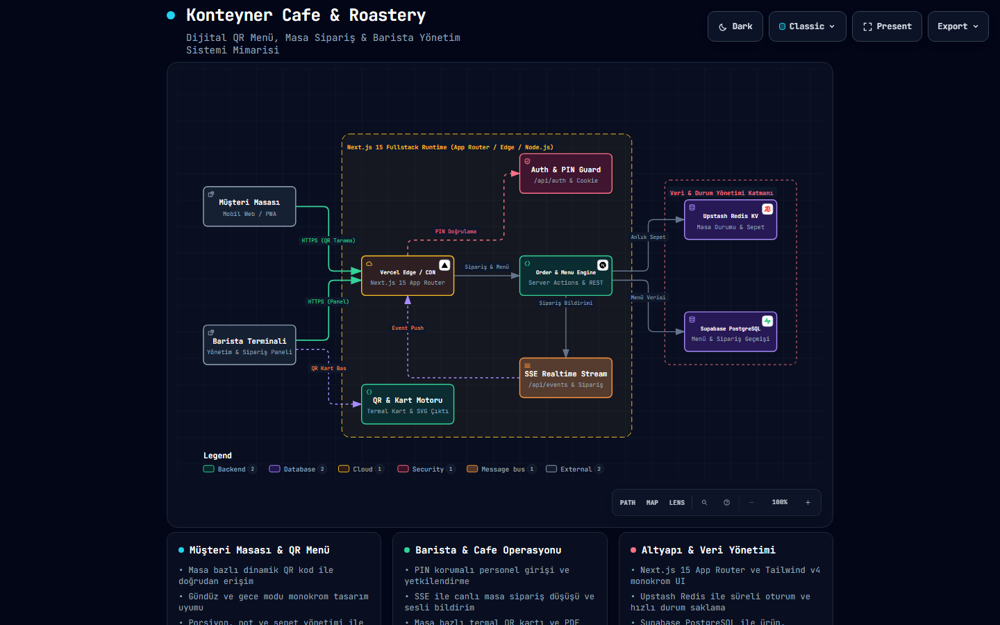
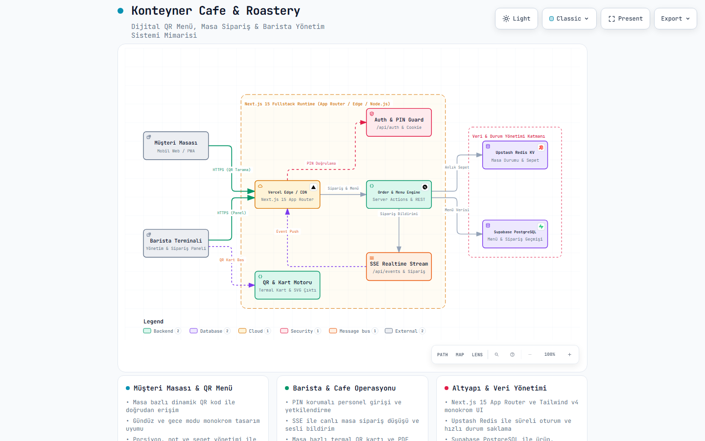
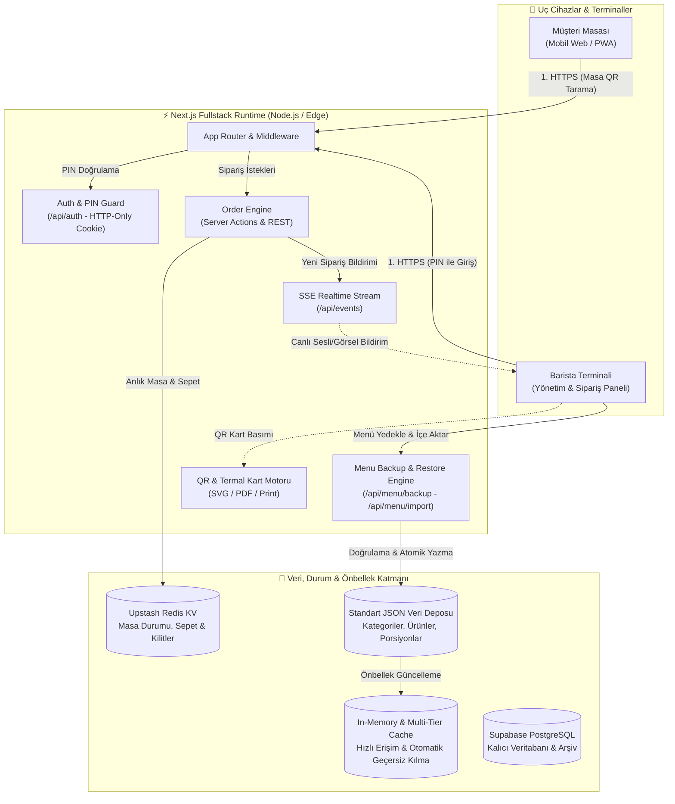

# Konteyner Cafe & Roastery ☕📦

> **Yeni Nesil Dijital QR Menü, Masa Sipariş, Kapsamlı Menü Yedekleme (Backup & Restore) & Canlı Barista Operasyon Yönetim Sistemi**


---

## 📖 Genel Bakış

**Konteyner Cafe & Roastery**, 3. nesil kahve dükkanları ve modern restoranlar için sıfırdan geliştirilmiş, uçtan uca dijital sipariş ve operasyon yönetim platformudur. 

Müşterilere masadaki QR kodu okutarak hızlı, zengin ve modern bir menü deneyimi sunarken; kafe personeli ve baristalara canlı sipariş takibi, termal masa kartı basımı, anlık masa yönetimi ve tam kapsamlı menü yedekleme/aktarma imkanı sağlar.

---

## 🏛️ Sistem Mimarisi (Architecture)

Yüksek performanslı Next.js App Router üzerinde çalışan sistem; masaya özel QR oturumu ile müşteri arayüzünü, PIN korumalı Barista Terminalini ve güvenli veri/yedekleme motorunu bir araya getirir.

### 📊 Mimari Şema Görselleri

#### 🌙 Gece Modu (Dark Mode)


#### ☀️ Gündüz Modu (Light Mode)


> **💡 Etkileşimli Mimari Görüntüleyici:**  
> Projenin tüm bileşen ilişkilerini, sunum modunu (Present), yakınlaştırma (Zoom/Pan) ve SVG/PNG dışa aktarma yeteneklerini içeren interaktif dosya:  
> 👉 [`konteyner-architecture.html`](./konteyner-architecture.html) | Şema Tanımı: [`konteyner.architecture.json`](./konteyner.architecture.json)

---

### 🧩 Mimari Akış Şeması (Mermaid)



---

## ⚡ Temel Özellikler

### 1. 📱 Müşteri Masası & QR Menü Deneyimi
* **Masaya Özel Oturum:** QR kod okutulduğunda masa numarasıyla otomatik senkronize olan müşteri arayüzü.
* **Detaylı Ürün İnceleme:** Tekli / Çoklu porsiyon seçimi (Single, Double vb.), şefin önerisi, vegan/glutensiz etiketleri, kalori ve alerjen uyarıları.
* **Gelişmiş Arama & Kategori Filtreleme:** Kahve çeşitleri, demleme yöntemleri, fırından taze lezzetler ve kahvaltı seçenekleri arasında anında arama.
* **Sepet & Sipariş Akışı:** Özel sipariş notu ekleme, alt bildirim çubuğu ve akıcı sepet deneyimi.

### 2. ☕ Barista & Kafe Operasyon Paneli
* **PIN Korumalı Güvenli Giriş:** Personele özel 4 haneli PIN doğrulaması ile oturum yönetimi.
* **Canlı Sipariş Akışı (Server-Sent Events - SSE):** Masalardan iletilen siparişlerin panele anlık sesli ve görsel bildirimle düşmesi.
* **Termal QR Masa Kartı Motoru:** Masalara özel QR kodlarını tek tıkla yazdırma, SVG ve yüksek çözünürlüklü baskı kartı formatında indirme.
* **Masa Durumu İzleme:** Masaların boş, dolu veya rezerve durumlarını tek ekrandan canlı takip etme.

### 3. 💾 Kapsamlı Menü Yedekleme ve İçe Aktarma (Backup & Restore)
* **Tek Tıkla Menü Dışa Aktarma (Export):** Tüm menü ağacını (kategoriler, ürünler, porsiyonlar, fiyatlar, görseller, alerjenler) zaman damgalı standart `.json` formatında anında indirme.
* **Güvenli ve Doğrulanmış İçe Aktarma (Import):** Yüklenen dosyaları şema kontrolünden (zorunlu alanlar, benzersiz ID'ler, geçerli fiyatlar) geçiren akıllı import motoru.
* **Görsel Önizleme & Doğrulama:** Yükleme öncesi kategori ve ürün sayısını gösteren önizleme paneli ve ayrıntılı hata raporlama.
* **Hazır Şablon İndirme:** Sıfırdan menü oluşturmak veya toplu düzenleme yapmak için tek tıkla indirilebilir örnek JSON şablonu.
* **Atomik Kayıt & Çok Katmanlı Önbellek Yenileme:** Başarısız yüklemelerde otomatik rollback mekanizması ve menü güncellendiğinde anında bellek önbelleklerinin temizlenmesi.

### 4. ☕ Dijital Kahve Sadakat Programı ("Özelleştirilebilir Damga Kartı")
* **Starbucks Tarzı Dijital Damga Kartı:** Müşterilerin cep telefonunda açılan, her içecek alışverişinde damga biriktirdiği interaktif fincan kartı.
* **Dinamik Hedef Damga Sayısı:** Panelden garson veya yönetici tarafından serbestçe seçilebilir hedef (3 Alana 4. Bedava, 4 Alana 5. Bedava vb.).
* **Özelleştirilebilir Ürün Kapsamı:** Tüm içecekler, seçili kahve kategorileri veya tekil ürünler bazında kampanya kapsamını panelden belirleme.
* **Hızlı Müşteri Tanıma & Kod Sistemi:** Müşterilere özel `#KNT-xxxx` kodu ve telefon ile anında arama, tek tıkla `+1 Damga` basma, geri alma ve hediye kullandırma.
* **KVKK Güvenli ve SMS'siz:** Ad Soyad ve Telefon ile cihaz hafızasında güvenli saklama; SMS bekleme zahmeti olmaksızın cihaz değişimlerinde hak koruma.

### 5. 🎨 Saf Monokrom & Modern Tasarım Dili
* **Gündüz Modu (Light):** Temiz beyaz zemin, derin siyah tipografi ve yüksek kontrastlı etkileşim elemanları.
* **Gece Modu (Dark):** Saf siyah zemin, yumuşak gri kartlar ve göz yormayan monokrom renk paleti.
* **Duyarlı (Responsive) Tasarım:** Mobil cihazlarda alt sayfa (bottom sheet) çekmecesi, masaüstünde ise genişletilmiş yatay kart modal mimarisi.

---

## 📂 Proje Dizin Yapısı

```text
kontenyer/
├── app/                              # Next.js App Router
│   ├── (auth)/login/                 # Personel PIN giriş sayfası
│   ├── (dashboard)/panel/            # Barista & operasyon paneli
│   ├── (public)/restaurant/table/    # Masa bazlı QR menü açılışı
│   ├── api/                          # REST & SSE API Uç Noktaları
│   │   ├── auth/                     # PIN doğrulama ve oturum açma/kapatma
│   │   ├── events/                   # Canlı SSE sipariş akışı
│   │   ├── menu/backup/              # Menü JSON dışa aktarma (Export)
│   │   ├── menu/import/              # Menü JSON doğrulama & içe aktarma (Import)
│   │   ├── menu/template/            # Örnek menü şablonu indirme
│   │   └── orders/                   # Sipariş oluşturma ve durum güncelleme
│   ├── menu/                         # Genel müşteri menü rotası
│   ├── layout.tsx                    # Kök layout ve tema sağlayıcıları
│   └── globals.css                   # Tailwind v4 monokrom CSS stilleri
├── components/                       # Yeniden kullanılabilir UI bileşenleri
│   ├── cart/                         # Sepet çubuğu, çekmecesi ve sipariş özeti
│   ├── dashboard/                    # Panel başlığı, sipariş kartları, menü yedekleme modalı
│   ├── menu/                         # Ürün kartları, kategori çubuğu, ürün detay modalı
│   └── ui/                           # Buton, badge, modal, input ve preloader bileşenleri
├── data/                             # Menü ve masa JSON veri kaynakları
│   ├── menu.json                     # Aktif kategori ve ürün listesi
│   └── tables.json                   # Masa tanımları ve durumları
├── lib/                              # Yardımcı fonksiyonlar, context ve veri depoları
│   ├── data/menu-store.ts            # Menü CRUD, validasyon, export/import motoru
│   ├── security/auth-guard.ts        # Güvenlik ve yetkilendirme yardımcıları
│   └── context/                      # Sepet, tema ve bildirim context sağlayıcıları
├── konteyner.architecture.json       # Archify mimari tanım şeması
├── konteyner-architecture.html       # Etkileşimli mimari görüntüleyici
└── public/                           # Statik logolar, ses dosyaları ve görseller
```

---

## 🚀 Kurulum ve Yerel Çalıştırma

### Gereksinimler
* **Node.js**: v18.18.0 veya üzeri (v20+ önerilir)
* **Paket Yöneticisi**: npm, pnpm veya yarn

### Adım Adım Kurulum

1. **Depoyu Klonlayın:**
   ```bash
   git clone https://github.com/emrahsahn/kontenyer-qr-menu.git
   cd kontenyer-qr-menu
   ```

2. **Bağımlılıkları Yükleyin:**
   ```bash
   npm install
   ```

3. **Ortam Değişkenlerini Tanımlayın (`.env.local`):**
   ```env
   # Upstash Redis (Opsiyonel / Canlı Dağıtım)
   UPSTASH_REDIS_REST_URL="your-upstash-url"
   UPSTASH_REDIS_REST_TOKEN="your-upstash-token"

   # Supabase (Opsiyonel / Kalıcı Veritabanı)
   NEXT_PUBLIC_SUPABASE_URL="your-supabase-url"
   NEXT_PUBLIC_SUPABASE_ANON_KEY="your-anon-key"
   ```

4. **Geliştirme Sunucusunu Başlatın:**
   ```bash
   npm run dev
   ```
   Tarayıcınız üzerinden erişin:
   * **Müşteri QR Menüsü:** [http://localhost:3000/menu](http://localhost:3000/menu)
   * **Örnek Masa 1 QR Menüsü:** [http://localhost:3000/restaurant/table/1](http://localhost:3000/restaurant/table/1)
   * **Barista & Operasyon Paneli:** [http://localhost:3000/panel](http://localhost:3000/panel)

5. **Üretim Derlemesi (Production Build):**
   ```bash
   npm run build
   npm run start
   ```

---

## 👨‍💻 Geliştirici & Katkıda Bulunanlar

Bu proje **Emrah Şahin** tarafından tasarlanmış ve geliştirilmiştir.

* **GitHub:** [@emrahsahn](https://github.com/emrahsahn)
* **Proje Deposu:** [kontenyer-qr-menu](https://github.com/emrahsahn/kontenyer-qr-menu)

---

## 📄 Lisans

Bu proje Konteyner Cafe & Roastery için özel olarak geliştirilmiştir. Tüm hakları saklıdır.
